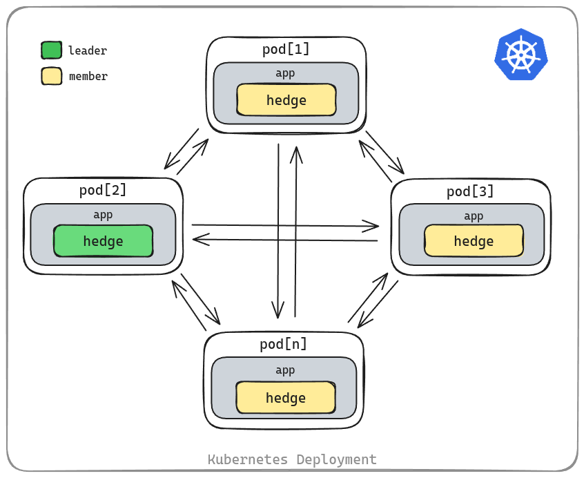

[](https://github.com/flowerinthenight/hedge/actions/workflows/main.yml)
[](https://quay.io/repository/flowerinthenight/hedgedemo)
[](https://pkg.go.dev/github.com/flowerinthenight/hedge)

(This repo is mirrored to [https://codeberg.org/flowerinthenight/hedge](https://codeberg.org/flowerinthenight/hedge)).

## hedge
A [Go](https://go.dev/) library built on top of [spindle](https://github.com/flowerinthenight/spindle) and [Cloud Spanner](https://cloud.google.com/spanner) that provides rudimentary distributed computing facilities to Kubernetes [Deployments](https://kubernetes.io/docs/concepts/workloads/controllers/deployment/). Features include a consistent, append-only, Spanner-backed distributed key/value storage, a distributed locking/leader election mechanism through spindle, a simple member-to-leader communication channel, a broadcast (send-to-all) mechanism, memory spill-over, and a distributed semaphore. It also works even on single-pod deployments.

<p align="center">
  
</p>

At the moment, **hedge** is heavily used in [Alphaus](https://www.alphaus.cloud/) production with services that scale from single digit pods to hundreds.

## Why?
First, I wanted a cluster coordinator that can work within k8s Deployments as a library, not as an external service (like [ZooKeeper](https://zookeeper.apache.org/), or [etcd](https://etcd.io/)). So far, our efforts in making [Raft](https://raft.github.io/) play well with bursty, frequently scaling up/down deployments as a library is not that reliable yet (though we have an ongoing multi-[Paxos](https://en.wikipedia.org/wiki/Paxos_(computer_science))-based experiment [here](https://github.com/alphauslabs/juno) as well). I also wanted an easily-accessible storage that is a bit decoupled from the code (easier to query, edit, debug, backup, etc). We are already a heavy Spanner user, and spindle has been in our production for many years now: these two should be able to do it; StatefulSets or DaemonSets shouldn't be a requirement. Since then, additional features have been added, such as the `Send()` API.

## What does it do?
Leader election is handled by [spindle](https://github.com/flowerinthenight/spindle). Two APIs are provided for storage: `Put()` and `Get()`. All pods can serve the `Get()` calls, while only the leader handles the `Put()` API. If a non-leader pod calls `Put()`, that call is forwarded to the leader, who will do the actual write. All `Put()`'s are append-only.

Spindle's `HasLock()` function is also available for distributed locking due to struct embedding, although you can use spindle separately for that, if you prefer.

A `Send()` API is also provided for members to be able to send simple request/reply-type messages to the current leader at any time. A streaming equivalent (gRPC) is also available.

A `Broadcast()` API is also available for all pods. Note that due to the nature of k8s deployments (pods come and go) and the internal heartbeat delays, some pods might not receive the broadcast message at call time, although all pods will have the complete broadcast target list eventually. Hedge uses a combination of heartbeats and broadcasts to propagate member information to all pods; non-leaders send liveness heartbeats to the leader while the leader broadcasts active members to all pods. A streaming equivalent (gRPC) is also available.

An experimental spill-over store (**SoS**) is also supported. It's currently used in bursty, quick load-process-discard type of data processing. A **SoS** in hedge is simply a combined memory area and a disk area between pods. For example, a pod can define a SoS of 1GB memory and 1GB disk. If there are 100 pods running under hedge, that's a combined storage of (1GB + 1GB) * 100. During writes and subsequent reads, hedge handles the data distribution and assembly between local RAM, disk, and between pods. It uses [Arrow](https://arrow.apache.org/) and memory mapped files as backing stores. You can check out this [blog post](https://flowerinthenight.com/blog/2024-07-24-spillover-store/) for more information.

Finally, a distributed semaphore is also provided through the `NewSemaphore()`, `[Try]Acquire()`, and `Release()` APIs.

## Prerequisites
* All pods within a cluster should be able to contact each other via TCP (address:port).
* Each hedge's instance id should be set using the pod's cluster IP address:port. You can use [downward API](https://kubernetes.io/docs/concepts/workloads/pods/downward-api/) to get the pod's IP address, or you can use the ":port" format in which case the IP address will be resolved internally.
* For now, spindle's lock table and hedge's log table are within the same database.
* Tables for spindle and hedge need to be created beforehand. See [here](https://github.com/flowerinthenight/spindle#usage) for spindle's DDL. For hedge, see below:

```sql
-- 'logtable' name is just an example
CREATE TABLE logtable (
    id STRING(MAX),
    key STRING(MAX),
    value STRING(MAX),
    leader STRING(MAX),
    timestamp TIMESTAMP OPTIONS (allow_commit_timestamp=true),
) PRIMARY KEY (key, id)
```

* This library will use the input key/value table (`logtable` in the example above) for its semaphore-related operations with the following reserved keywords:
```
column=key, value=__hedge/semaphore/{name}
column=key, value=__caller={ip:port}
column=id, value=__hedge/semaphore/{name}
column=id, value=limit={num}
```

## How to use
Something like:
```go
ctx := context.Background()
client, _ := spanner.NewClient(ctx, "your/spanner/database")
defer client.Close()

op := hedge.New(
    client,
    ":8080", // addr will be resolved internally
    "locktable",
    "myspindlelock",
    "logtable",
    hedge.WithLeaderHandler( // if leader only, handles Send()
        nil,
        func(data interface{}, msg []byte) ([]byte, error) {
            log.Println("[send] received:", string(msg))
            return []byte("hello " + string(msg)), nil
        },
    ),
    hedge.WithBroadcastHandler( // handles Broadcast()
        nil,
        func(data interface{}, msg []byte) ([]byte, error) {
            log.Println("[broadcast] received:", string(msg))
            return []byte("broadcast " + string(msg)), nil
        },
    ),
})

ctx, cancel := context.WithCancel(ctx)
done := make(chan error, 1) // optional wait
go op.Run(ctx, done)

// For storage, any pod should be able to call op.Put(...) or op.Get(...) here.
//
// Any pod can call HasLock() here at any given time to know whether they are
// leader or not.
//
//   hl, _ := op.HasLock()
//   if hl {
//     log.Println("leader here!")
//   }
//
// To send a message to the current leader, any pod can call op.Send(...) and
// the leader will handle it through the WithLeaderHandler callback. A wrapper
// SendToLeader() helper function is also available for calling op.Send() with
// retries+backoff.
//
// For broadcast, any pod can call op.Broadcast(...) here which will be handled
// by each pod's WithBroadcastHandler callback, including the caller.
//
// For distributed semaphore, any pod can call the following:
//
//   sem, _ := op.NewSemaphore(ctx, "semaphore-name", 2)
//   sem.Acquire(ctx)
//   ...
//   sem.Release(ctx)

cancel()
<-done
```

A sample [deployment](./deployment_template.yaml) file for GKE is provided, although it needs a fair bit of editing (for auth) to be usable. It uses [Workload Identity Federation](https://cloud.google.com/kubernetes-engine/docs/how-to/workload-identity) for authentication although you can update it to use other authentication methods as well. The service account needs to have Spanner permissions.

Once deployed, you can do the following tests while checking the logs. We will use [kubepfm](https://github.com/flowerinthenight/kubepfm) to port-forward our test commands to the server.

Test the `Put()` API:

```sh
# Open a terminal and run:
$ kubepfm --target deployment/hedgedemo:9090:9090

# Open another terminal and run:
$ curl localhost:9090/put -d "samplekey samplevalue"

# To ensure a non-leader sender, you can also specify a
# non-leader pod for the kubepfm command above:
$ kubepfm --target hedgedemo-6b5bcd4998-n95n7:9090:9090
```

Test the `Get()` API:

```sh
# While kubepfm is running on a different terminal, run:
$ curl localhost:9090/get -d "samplekey"
```

Test the `Send()` API:

```sh
# While kubepfm is running on a different terminal, run:
$ curl localhost:9090/send -d "hello-world"
```

Test the `Broadcast()` API:

```sh
# While kubepfm is running on a different terminal, run:
$ curl localhost:9090/broadcast -d "hello-all"
```
